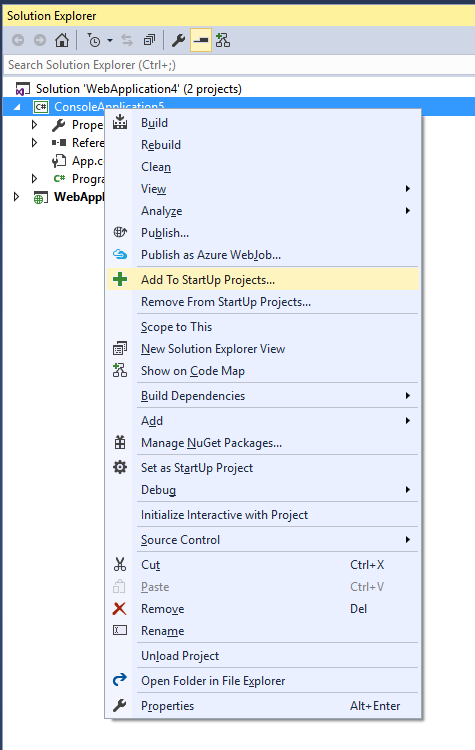
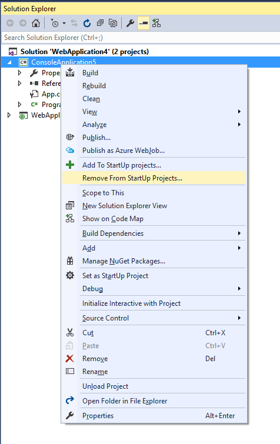

# StartupProjects

Download this extension from the [VS Gallery](https://visualstudiogallery.msdn.microsoft.com/f9c9ddaf-9665-4886-8d13-1a30a9d3286d)
or get the [CI build](http://vsixgallery.com/extension/00302942-1ef6-4dcd-b25c-a82e02a661f9/).

---------------------------------------

The easiest way to add/remove project to a startup projects directly from Solution Explorer.

See the [changelog](CHANGELOG.md) for changes and roadmap.

## Features

- Add project to startup projects from Solution Explorer 
- Remove project from startup project from Solution Explorer

### Add to startup projects
- Select a project and right click, then select 'Add To StartUp Project...'

### Remove from startup projects
- Select a project and right click, then select 'Remove from StartUp Projects...'

## Contribute
Check out the [contribution guidelines](CONTRIBUTING.md)
if you want to contribute to this project.

For cloning and building this project yourself, make sure
to install the
[Extensibility Tools 2015](https://visualstudiogallery.msdn.microsoft.com/ab39a092-1343-46e2-b0f1-6a3f91155aa6)
extension for Visual Studio which enables some features
used by this project.

## License
[Apache 2.0](LICENSE)